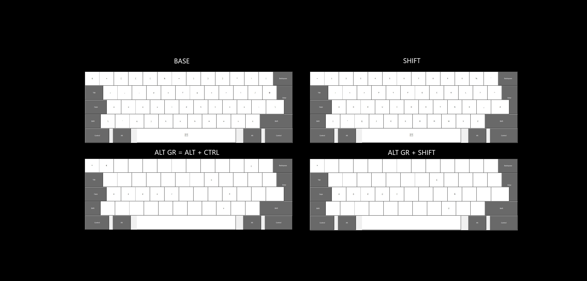

# DualEnglishSpanishProgrammerDvorak
The Dvorak Layout but with sopport for some latin languages.

Based on [this other layout](https://github.com/jayliu50/windows-programmer-dvorak/). On Windows you still need the [Microsoft Keyboard Layout Creator](https://www.microsoft.com/en-us/download/details.aspx?id=102134). For Linux based systems, use something like [this](https://github.com/asvd/programmer-dvorak-eu). They aren't the same.

